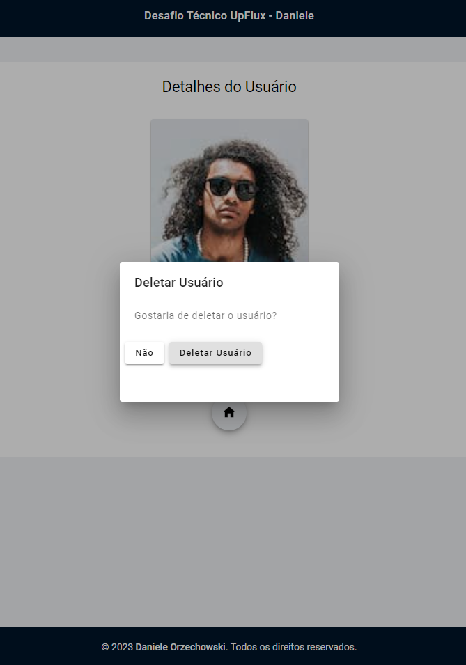

# Front-End Developer Challenge - User Management UI


Este projeto tem como objetivo demonstrar a criação de UIs para gerenciar dados de usuários, utilizando Angular 16, com a integração de uma API REST para manipulação dos dados. A aplicação permite operações de CRUD (Criar, Ler, Atualizar, Excluir) sobre a entidade [Usuário], com uma tela principal e uma tela de detalhes.

<p align="center">
  <p>
    
    
  </p>
    <p>
    
    
  </p>
    <p>
    
    
  </p>
      <p>
    
    
  </p>
</p>

## Funcionalidades

- [x] Interface amigável com a utilização do Material UI do Angular.
- [x] Tela Principal:
  - [x] Lista com resumo dos dados dos usuários.
  - [x] Exportação dos dados visíveis para PDF ou Excel (CSV ou XSLX).
  - [x] Inclusão de novos dados através de um modal.
  - [x] Campo de pesquisa rápida (Client Side).
  - [x] Opções de alteração e exclusão de um usuário através de um modal.
  - [x] Visualização de detalhes para cada usuário na lista.
  - [x] Paginação para a listagem da tabela.
- [x] Tela de Detalhes:
  - [x] Apresentação de todos os dados cadastrados do usuário selecionado, incluindo avatar.
  - [x] Opção de editar ou deletar usuário.
  - [x] Opção de retornar à Tela Principal.
- [x] Programação reativa com RxJS para lidar com fluxos de dados assíncronos.
- [x] Snackbars laterais com mensagens de sucesso e erro em todas as requests.
- [x] Validações da obrigatoriedade do preenchimento completo dos formulários.
- [x] Validações da formato de e-mail nos formulários.
- [x] Validações da formato de url para avatar nos formulários.
- [x] Links de "mailto" em todos os e-mails que aparecem no projeto.

## Pré-requisitos

Para executar este projeto localmente, é necessário ter instalado:

- Node.js
- npm (Node Package Manager)

## Iniciando

- Clone o repositório para sua máquina:

```bash
git clone https://github.com/DaniOrze/desafio_tecnico_daniele.git
```

- Navegue até a pasta do projeto:

```bash
cd desafio_tecnico_daniele
```

### Rodando o Front-end

- Instale as dependências:

```bash
npm install
```

- Execute a aplicação:

```bash
ng serve
```

A aplicação será iniciada no navegador padrão em: `http://localhost:4200`

### Executandos os testes unitários

```bash
ng test
```

### Executandos os testes unitários com cobertura

```bash
ng test --code-coverage --source-map
```


## Contribuições

Contribuições são bem-vindas! Sinta-se à vontade para abrir uma issue ou enviar um pull request para o repositório.

## Licença

Este projeto está licenciado sob a licença [MIT](./LICENSE).
